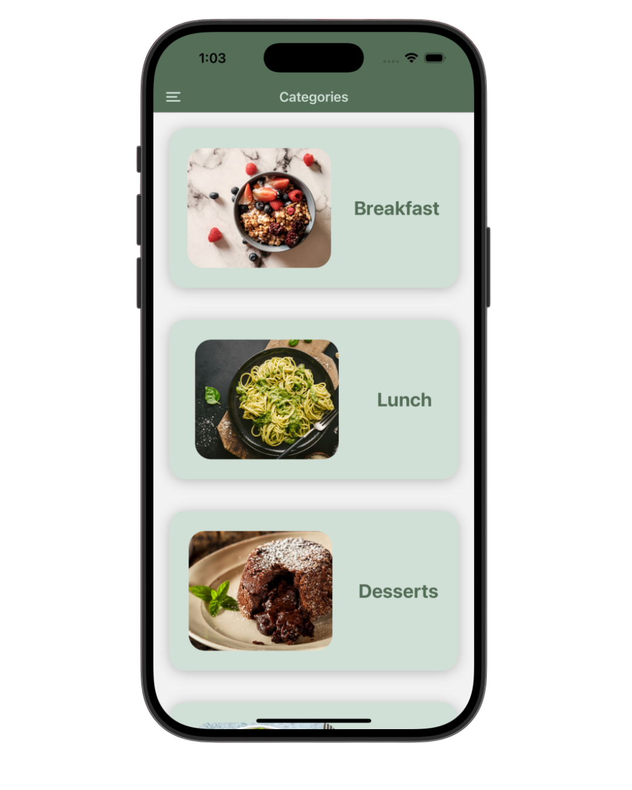
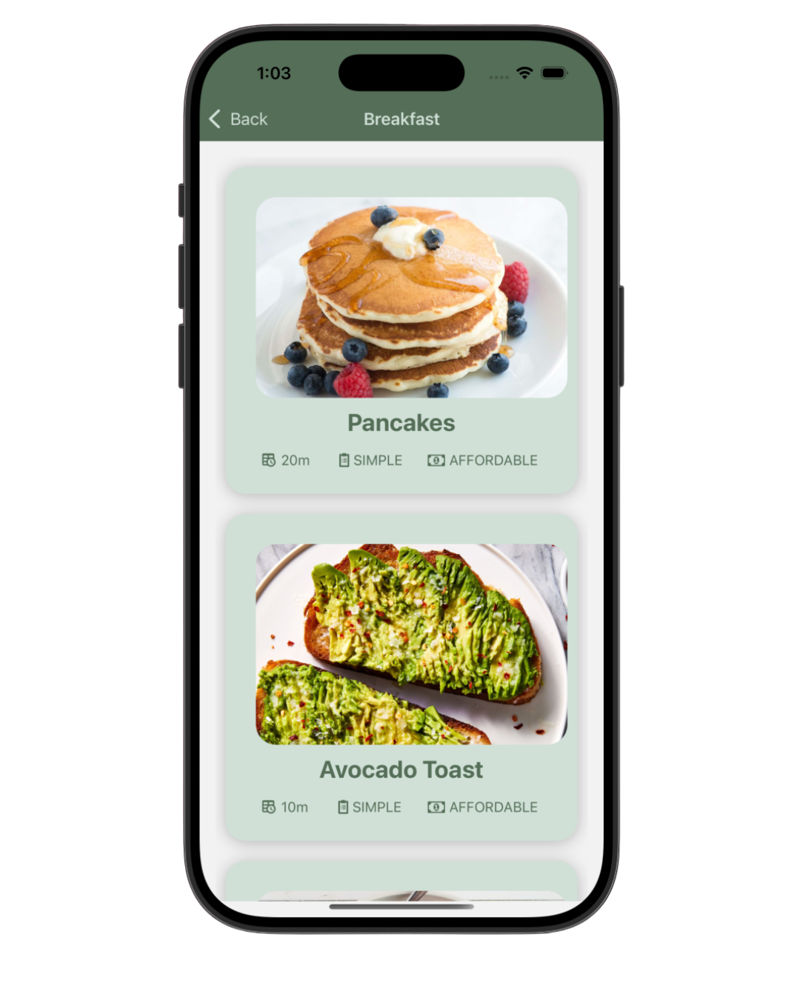
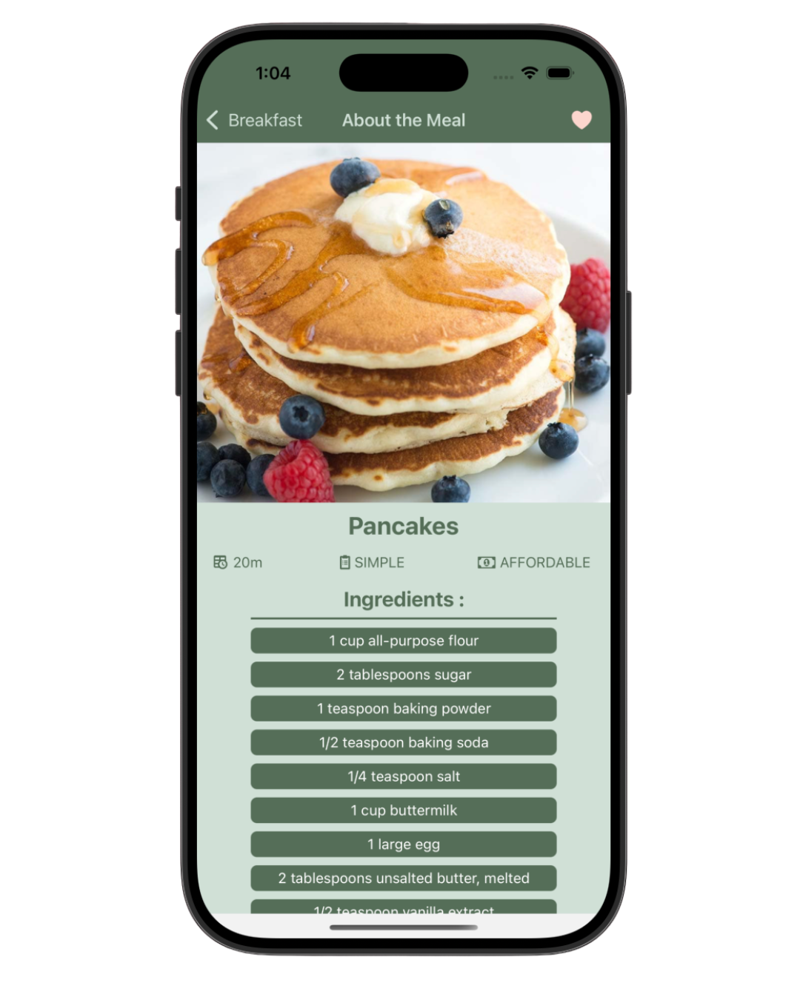
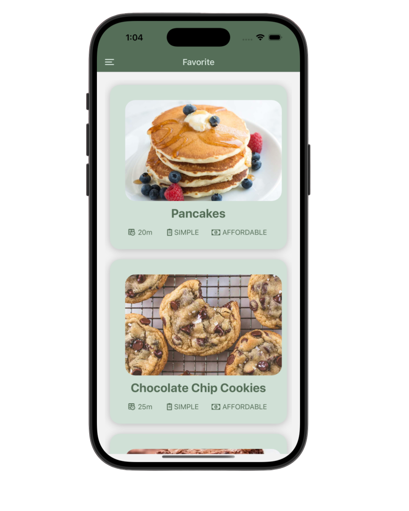

# 👩🏻‍🍳 Recipes App – React Native

A beginner-friendly mobile app built with **React Native** and **Expo** that lets users browse categorized meals and view their details including ingredients ,steps, cooking time, complexity, and effort level

---

## ✨ Features

- Categorized recipes (Breakfast, Lunch, Dinner, Dessert)
-  View ingredients and cooking steps
-  Built with React Native + Expo

---

## 📸 Screenshots

### 🏠 Home Screen

### 🍽️ Meal Categories Screen

### 📋 Meal Details Screen

### 🩷 Favorites Meals Screen

---

## 🛠️ Tech Stack

- [React Native](https://reactnative.dev/)
- [Expo](https://expo.dev/)
- JavaScript (ES6+)
- Static local data (`meals.js`)

---

